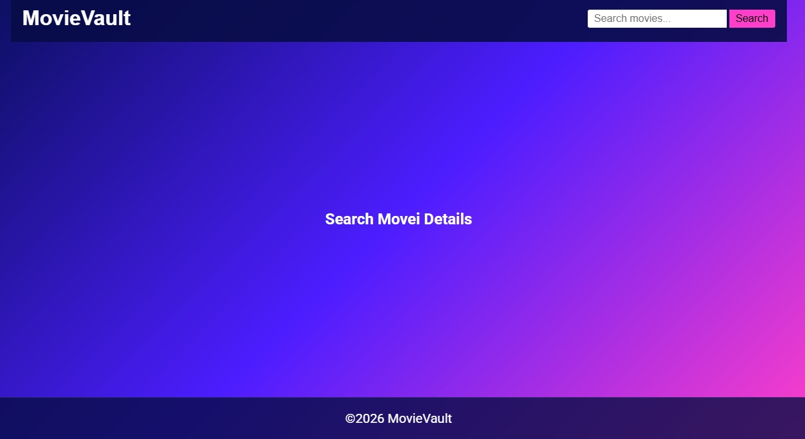
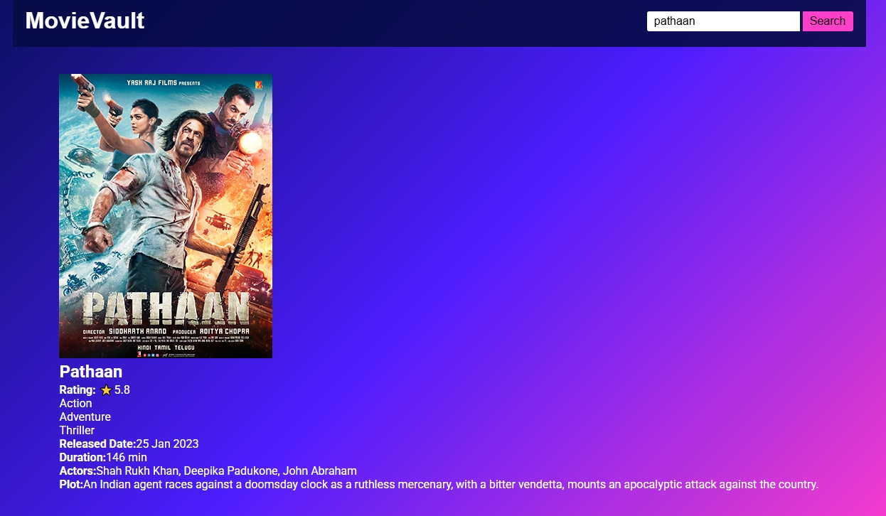
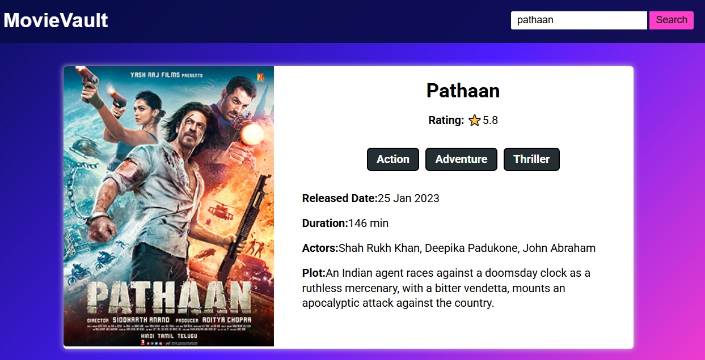
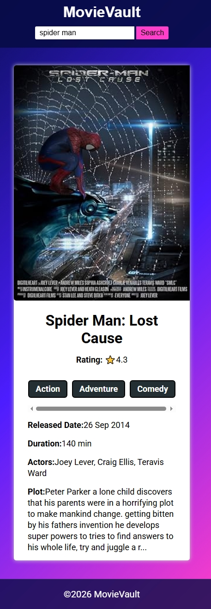
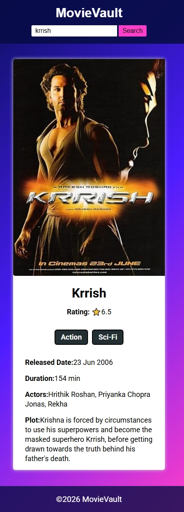
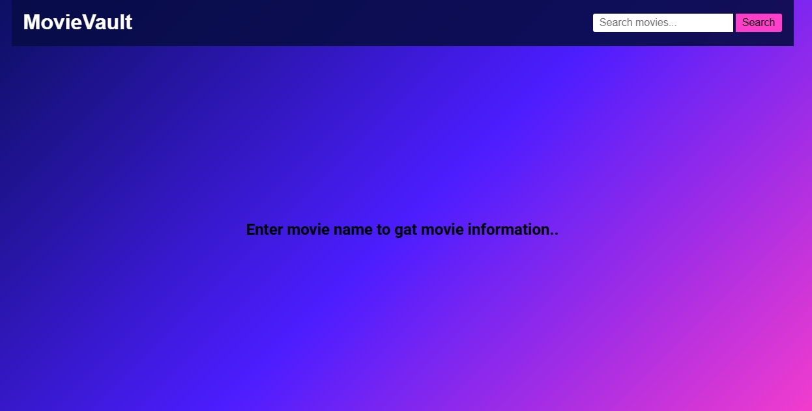
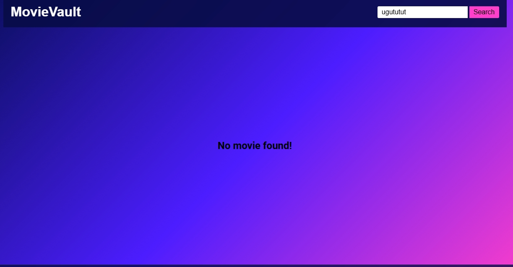

🎬 MovieVault

MovieVault is a responsive movie search web application built using HTML, CSS, and JavaScript. It allows users to search for movies and view detailed information such as ratings, release date, genre, runtime, actors, plot, and movie posters using the OMDb API.

## Start Date
             
           --08/06/2026   

   ## Live Demo=>   https://github.com/uvais8958/movievault.git   

              

🚀 Features

- Search movies by title
- Display movie details instantly
- View IMDb ratings
- Show movie posters
- Responsive user interface
- Real-time data fetched from OMDb API

🛠️ Technologies Used

- HTML5
- CSS3
- JavaScript (ES6)
- OMDb API

📸 Screenshots

.jpeg)
.jpeg)

                                         
🔧 Installation

1. Clone the repository:
   
   git clone https://github.com/uvais8958/movievault.git

2. Open the project folder.

3. Run "index.html" in your browser.

📂 Project Structure

MovieVault/
│
├── index.html
├── style.css
├── script.js
|

|__assets/screenshorts

└── README.md

🌐 API Used

OMDb API - https://www.omdbapi.com/

👨‍💻 Developed By

Uvais Ansari